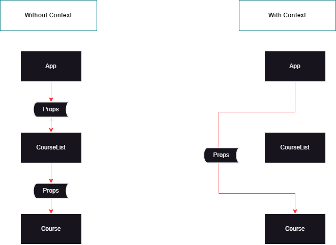

# Can-Boz-React-Egitimi Notlarım

<details>
<summary>Component Mantığı</summary>

* Proje açılması : npm create vite@latest
Functional Component açma kısayolu : rafc

* Alternatif props tanımlaması
```
function Course(props){
return ( <div></div>);}
```

* Props nedir?
Conceptually, components are like JavaScript functions. They accept arbitrary inputs (called “props”) and return React elements describing what should appear on the screen.
</details>

<details>
<summary>State Mantığı</summary>

* State kullanım mantığı
Başlangıçta bir değişkene değer atanması isteniyor ve sonrasında bu değişkeni değiştirip o değişkenin tutulması istendiği durumlarda kullanılır.
useState, React'ta bir bileşenin durumunu (state) yönetmek için kullanılan bir fonksiyondur. React bileşenleri genellikle statik değil, değişken bir davranış sergilerler. Bu nedenle, bileşenlerin durumlarını dinamik olarak değiştirmek ve güncellemek gerekebilir.
useState, bir fonksiyon bileşeni içinde kullanılarak, bileşenin durumunu oluşturur ve güncellemesine olanak tanır. Böylece, bileşenin durumunu değiştirerek, bileşenin yeniden render edilmesi sağlanır ve kullanıcılara daha iyi bir kullanıcı deneyimi sunulabilir.
useState, aynı zamanda React'ta kontrollü bileşenler (controlled components) oluşturmak için de kullanılabilir. Kontrollü bileşenler, girdi değerlerinin bileşen durumu ile senkronize edildiği ve kullanıcının bu girdileri değiştirdiğinde bileşenin durumunun güncellendiği bileşenlerdir. Bu da, form gibi kullanıcı girdilerinin olduğu bileşenlerde kullanışlı bir özelliktir.

* useStateSnippet : kısayolu
```
const [value,setValue] = useState(0);
value : değişken,
setValue : değişken ataması için fonksiyon
useState(0) : başlangıç değeri
```

* Kullanım için import edilmesi gerekmektedir. ( import {useState } from 'react'; )
</details>


<details>
<summary>Javascript Notlar</summary>

 * Daha verimli JS code 
 ```
const title = props.title;
const description = props.description;
const {title,description} = props;
```
 
* ...(spread operatörü) ile ilkinin üzerine eklenir.

* Javascript'te key ve value değerleri eşit ise
(Course.jsx içinde görülebilir.)
```
 Angular: Angular,
 Bootstrap: Bootstrap,
 cSharp: cSharp,
 Web: Web 
```
yerine
```
 Angular,
 Bootstrap,
 cSharp,
 Web 
```
 şeklinde kullanılabilir.
 
* Async/await yapısı sayesinde, asenkron işlemler çağrıldıklarında promise objeleri döndürür ve bu objeler "await" anahtar kelimesiyle bekletilir. Bu sayede, işlemin tamamlanması beklenir ve işlem tamamlandığında sonuç döndürülür. Ayrıca, async fonksiyonlarında hata yönetimi de daha kolay hale gelir, çünkü hata yakalama mekanizması "try-catch" blokları kullanılarak gerçekleştirilir.
 </details>
 


<details>
 <summary>useEffect</summary>
 * useEffect, bileşenin her render işleminden sonra otomatik olarak çağrılır. Bu, bileşenin durumundaki veya özelliklerindeki değişiklikler gibi renderi tetikleyen herhangi bir şey olduğunda useEffect'in yeniden çağrılacağı anlamına gelir. Ayrıca bileşen ilk kez render edildiğinde de çağrılır.
 
```
 useEffect(() => {
    console.log(
      "Bu kod ilk defa çağrıldığında çalışır ve içerisindeki herhangi bir state değeri değiştirildiğinde tekrar çalışır."
    );
  });

  useEffect(() => {
    console.log(
      "Bu kod ilk defa çağrıldığında çalışır ve daha sonra state değişse de çalışmaz."
    );
  }, []);

  useEffect(() => {
    console.log(
      "Bu kod ilk defa çağrıldığında çalışır ve daha sonra can state'i değişirse çalışır."
    );
  }, [can]);
 ```
</details>
 
 
   <details>
 <summary>useContext</summary>
 
 * useContext props taşımaya gerek kalmadan,child elementlerden direk kullanılabilmesini sağlar.

 
 
 ```
 import React from "react";

const authContext = React.createContext({ status: null, login: () => {} });

export default authContext;

 ```
 ```
 const { status, login } = useContext(authContext);
  ```
</details>
